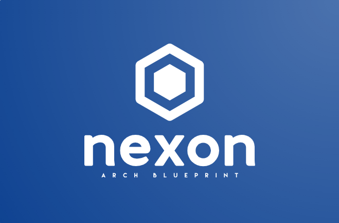

<!-- Improved compatibility of back to top link: See: https://github.com/othneildrew/Best-README-Template/pull/73 -->
<a id="readme-top"></a>
<!--
*** Thanks for checking out the Best-README-Template. If you have a suggestion
*** that would make this better, please fork the repo and create a pull request
*** or simply open an issue with the tag "enhancement".
*** Don't forget to give the project a star!
*** Thanks again! Now go create something AMAZING! :D
-->


<!-- PROJECT SHIELDS -->
<!--
*** I'm using markdown "reference style" links for readability.
*** Reference links are enclosed in brackets [ ] instead of parentheses ( ).
*** See the bottom of this document for the declaration of the reference variables
*** for contributors-url, forks-url, etc. This is an optional, concise syntax you may use.
*** https://www.markdownguide.org/basic-syntax/#reference-style-links
-->
[![Contributors][contributors-shield]][contributors-url]
[![Forks][forks-shield]][forks-url]
[![Stargazers][stars-shield]][stars-url]
[![Issues][issues-shield]][issues-url]
[![project_license][license-shield]][license-url]
[![LinkedIn][linkedin-shield]][linkedin-url]


<!-- PROJECT LOGO -->
<!-- https://myfreelogomaker.com/editor/207300830 -->
<br />
<div align="center">
  <a href="https://github.com/emidiomorgia/nexon">
    
  </a>

<h3 align="center">nexon</h3>

  <p align="center">
    About Dev Experiments on dotnet, ddd, clean architecture, tdd, microservices, devops
    <br />
    <a href="https://github.com/emidiomorgia/nexon"><strong>Explore the docs »</strong></a>
    <br />
    <br />
    <!-- <a href="https://github.com/emidiomorgia/nexon">View Demo</a>
    · -->
    <a href="https://github.com/emidiomorgia/nexon/issues/new?labels=bug&template=bug-report---.md">Report Bug</a>
    ·
    <a href="https://github.com/emidiomorgia/nexon/issues/new?labels=enhancement&template=feature-request---.md">Request Feature</a>
  </p>
</div>


<!-- TABLE OF CONTENTS -->
<details>
  <summary>Table of Contents</summary>
  <ol>
    <li>
      <a href="#about-the-project">About The Project</a>
      <ul>
        <li><a href="#built-with">Built With</a></li>
      </ul>
    </li>
    <li>
      <a href="#getting-started">Getting Started</a>
      <ul>
        <li><a href="#prerequisites">Prerequisites</a></li>
        <!-- <li><a href="#installation">Installation</a></li> -->
      </ul>
    </li>
    <!-- <li><a href="#usage">Usage</a></li> -->
    <li><a href="#roadmap">Roadmap</a></li>
    <li><a href="#contributing">Contributing</a></li>
    <li><a href="#license">License</a></li>
    <li><a href="#contact">Contact</a></li>
    <!-- <li><a href="#acknowledgments">Acknowledgments</a></li> -->
  </ol>
</details>


<!-- ABOUT THE PROJECT -->
## About The Project

<!-- [![Product Name Screen Shot][product-screenshot]](https://example.com) -->

Dev Experiments on dotnet, ddd, clean architecture, tdd, microservices, devops

<p align="right">(<a href="#readme-top">back to top</a>)</p>


### Built With


* [![Angular][Angular.io]][Angular-url]
* [![Bootstrap][Bootstrap.com]][Bootstrap-url]
* [![.NET][dotnet-logo]][dotnet-url]


<p align="right">(<a href="#readme-top">back to top</a>)</p>


<!-- GETTING STARTED -->
## Getting Started

Clone the repository, open front-end project with editor of your choice, open backend solution containing every microservice project. Executing the solution will start Aspire. Run development docker-compose for event bus and database development images.

### Prerequisites

In order to run this project you need to setup: Nodejs, npm, Angular, .NET and optionally Docker
* Node.js
  Follow the setup instruction at https://nodejs.org
* npm
  ```sh
  npm install npm@latest -g
  ```
* Angular
  ```sh
  npm install -g @angular/cli
  ```
* .NET
  Follow the setup instruction at https://dotnet.microsoft.com/
* Docker
  Follow the setup instruction at https://docs.docker.com/


<!-- ### Installation

1. Get a free API Key at [https://example.com](https://example.com)
2. Clone the repo
   ```sh
   git clone https://github.com/emidiomorgia/nexon.git
   ```
3. Install NPM packages
   ```sh
   npm install
   ```
4. Enter your API in `config.js`
   ```js
   const API_KEY = 'ENTER YOUR API';
   ```
5. Change git remote url to avoid accidental pushes to base project
   ```sh
   git remote set-url origin emidiomorgia/nexon
   git remote -v # confirm the changes
   ```

<p align="right">(<a href="#readme-top">back to top</a>)</p> -->


<!-- USAGE EXAMPLES -->
<!-- ## Usage

Use this space to show useful examples of how a project can be used. Additional screenshots, code examples and demos work well in this space. You may also link to more resources.

_For more examples, please refer to the [Documentation](https://example.com)_

<p align="right">(<a href="#readme-top">back to top</a>)</p> -->


<!-- ROADMAP -->
## Roadmap

- [ ] Project setup
<!-- - [ ] Feature 2
- [ ] Feature 3
    - [ ] Nested Feature -->

See the [open issues](https://github.com/emidiomorgia/nexon/issues) for a full list of proposed features (and known issues).

<p align="right">(<a href="#readme-top">back to top</a>)</p>


<!-- CONTRIBUTING -->
## Contributing

Contributions are what make the open source community such an amazing place to learn, inspire, and create. Any contributions you make are **greatly appreciated**.

If you have a suggestion that would make this better, please fork the repo and create a pull request. You can also simply open an issue with the tag "enhancement".
Don't forget to give the project a star! Thanks again!

1. Fork the Project
2. Create your Feature Branch (`git checkout -b feature/AmazingFeature`)
3. Commit your Changes (`git commit -m 'Add some AmazingFeature'`)
4. Push to the Branch (`git push origin feature/AmazingFeature`)
5. Open a Pull Request

<p align="right">(<a href="#readme-top">back to top</a>)</p>

### Top contributors:

<a href="https://github.com/emidiomorgia/nexon/graphs/contributors">
  
</a>


<!-- LICENSE -->
## License

Distributed under the MIT license. See `LICENSE.txt` for more information.

<p align="right">(<a href="#readme-top">back to top</a>)</p>


<!-- CONTACT -->
## Contact

Emidio Morgia - emidio@morgia.info

Project Link: [https://github.com/emidiomorgia/nexon](https://github.com/emidiomorgia/nexon)

<p align="right">(<a href="#readme-top">back to top</a>)</p>


<!-- ACKNOWLEDGMENTS -->
<!-- ## Acknowledgments

* []()
* []()
* []()

<p align="right">(<a href="#readme-top">back to top</a>)</p> -->


<!-- MARKDOWN LINKS & IMAGES -->
<!-- https://www.markdownguide.org/basic-syntax/#reference-style-links -->
[contributors-shield]: https://img.shields.io/github/contributors/emidiomorgia/nexon.svg?style=for-the-badge
[contributors-url]: https://github.com/emidiomorgia/nexon/graphs/contributors
[forks-shield]: https://img.shields.io/github/forks/emidiomorgia/nexon.svg?style=for-the-badge
[forks-url]: https://github.com/emidiomorgia/nexon/network/members
[stars-shield]: https://img.shields.io/github/stars/emidiomorgia/nexon.svg?style=for-the-badge
[stars-url]: https://github.com/emidiomorgia/nexon/stargazers
[issues-shield]: https://img.shields.io/github/issues/emidiomorgia/nexon.svg?style=for-the-badge
[issues-url]: https://github.com/emidiomorgia/nexon/issues
[license-shield]: https://img.shields.io/github/license/emidiomorgia/nexon.svg?style=for-the-badge
[license-url]: https://github.com/emidiomorgia/nexon/blob/master/LICENSE.txt
[linkedin-shield]: https://img.shields.io/badge/-LinkedIn-black.svg?style=for-the-badge&logo=linkedin&colorB=555
[linkedin-url]: https://linkedin.com/in/emidio-morgia-93127a35
[product-screenshot]: images/screenshot.png
[Angular.io]: https://img.shields.io/badge/Angular-DD0031?style=for-the-badge&logo=angular&logoColor=white
[Angular-url]: https://angular.io/
[Bootstrap.com]: https://img.shields.io/badge/Bootstrap-563D7C?style=for-the-badge&logo=bootstrap&logoColor=white
[Bootstrap-url]: https://getbootstrap.com
[dotnet-url]: https://dotnet.microsoft.com/en-us
[dotnet-logo]: https://img.shields.io/badge/Dotnet-734cb7?style=for-the-badge&logo=.net&logoColor=white